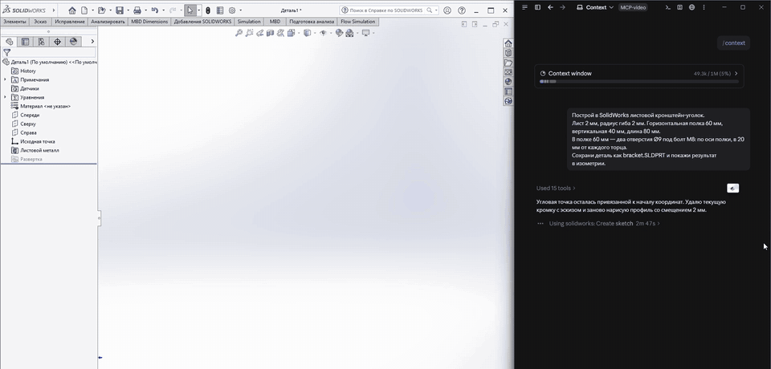

# MCP-сервер для SolidWorks

[English](README.md) · **Русский**

[MCP](https://modelcontextprotocol.io)-сервер в одном файле: через него нейросеть управляет SolidWorks по COM API. Вы описываете деталь в чате, модель сама строит эскиз, базовую кромку, отверстия и развёртку в DXF, вызывая инструменты. Без кликов мышью в SolidWorks и без записанных макросов.



*Слева SolidWorks, справа чат. Запись ускорена; к SolidWorks за всю сессию никто не прикасается.*

## Что умеет

27 инструментов. Все длины — в **миллиметрах**, углы — в градусах: сервер сам переводит их в метры и радианы, которых ждёт API SolidWorks.

| Группа | Инструменты |
|---|---|
| Подключение и документы | `connect_solidworks`, `list_open_documents`, `create_part`, `create_assembly`, `open_document`, `save_document`, `close_document` |
| Посмотреть и прочитать модель | `screenshot`, `get_feature_tree`, `get_mass_properties`, `get_sheet_metal_info`, `get_dimension` |
| Правка | `set_dimension`, `rebuild` |
| Эскиз | `create_sketch`, `sketch_rectangle`, `sketch_circle`, `sketch_line`, `close_sketch` |
| Листовой металл | `create_base_flange`, `cut_through`, `export_flat_pattern_dxf` |
| Сборки | `get_components`, `add_component`, `select_for_mate`, `add_mate` |
| Запасной выход | `execute_python` — выполняет код на Python с прямым доступом к COM API SolidWorks, когда готового инструмента нет |

`save_document` заодно экспортирует по расширению: `.step`, `.dxf`, `.pdf`, `.stl`.

`screenshot` важнее, чем кажется: так модель видит, что у неё получилось, и ловит собственные ошибки.

## Что нужно

- Windows, SolidWorks установлен и запущен
- Python 3.10 или новее
- MCP-клиент: Claude Desktop, Claude Code или любой другой, который умеет запускать локальный stdio-сервер

Проверено на SolidWorks 2024 SP5 (русская версия), Python 3.14, pywin32 312. На других версиях не проверялось — см. раздел [«Что важно знать»](#что-важно-знать).

## Установка

```
git clone https://github.com/aiforyouself/solidworks-mcp-server.git
cd solidworks-mcp-server
pip install -r requirements.txt
```

Или просто скачайте `solidworks_mcp_server.py` и выполните `pip install mcp pywin32 pillow`.

## Подключение

**Claude Code**

```
claude mcp add solidworks -- python C:\path\to\solidworks_mcp_server.py
```

**Claude Desktop** — Settings → Developer → Edit Config, добавьте сервер в `claude_desktop_config.json` и полностью перезапустите приложение:

```json
{
  "mcpServers": {
    "solidworks": {
      "command": "python",
      "args": ["C:\\path\\to\\solidworks_mcp_server.py"]
    }
  }
}
```

Путь к файлу — полный. Если `python` не прописан в PATH, укажите в `command` полный путь к `python.exe`.

## Попробовать

Запустите SolidWorks и напишите модели:

> Построй в SolidWorks листовой кронштейн-уголок. Лист 2 мм, радиус гиба 2 мм. Горизонтальная полка 60 мм, вертикальная 40 мм, длина 80 мм. В полке 60 мм — два отверстия Ø9 под болт М8: по оси полки, в 20 мм от каждого торца. Сохрани деталь как bracket.SLDPRT и покажи результат в изометрии.

Это запрос из анимации выше. Что было в той сессии — по журналу вызовов самого сервера:

- 58 вызовов инструментов примерно за 9 минут
- 18 из них — свой код через `execute_python`
- 9 вызовов вернули ошибку API; модель переписала их и повторила
- первая кромка получилась 62 × 42 мм вместо 60 × 40: толщина легла наружу. Модель измерила результат, заметила это, удалила элемент и построила заново — без подсказки

То есть рассчитывайте на рабочую деталь, а не на чистый проход с первого раза. Перед тем как отдавать развёртку на лазер, проверьте размеры.

## Что важно знать

- **`execute_python` выполняет произвольный код на вашем компьютере** с вашими правами. Это и делает сервер полезным за пределами 26 готовых инструментов, и это же риск. Используйте его только с клиентом и моделью, которым доверяете, не отключайте запросы на подтверждение и не открывайте сервер в сеть.
- **Сигнатуры API различаются между версиями SolidWorks.** Например, в SolidWorks 2024 `InsertSheetMetalBaseFlange2` принимает 19 аргументов, а `FeatureCut4` — 27. Если инструмент не сработал на вашей версии, сообщение об ошибке подскажет модели перейти на `execute_python` и официальную справку по API.
- **Имена плоскостей и элементов зависят от языка SolidWorks.** По умолчанию `create_sketch` берёт плоскость `Спереди`. В английской версии попросите модель явно указывать `Front Plane`, `Top Plane`, `Right Plane`.
- **Описания инструментов, сообщения об ошибках и комментарии в коде — на русском.** Моделям это не мешает.
- **Оси эскиза на плоскости «Сверху»:** `y` эскиза — это `−Z` модели. Отверстие в точке модели (x, z) рисуется в эскизе как (x, −z).
- **Модальные окна блокируют SolidWorks.** Если открыт диалог сохранения или перестроения, вызов через 55 секунд вернёт понятную ошибку, а не зависнет. Закройте окно и повторите.
- **Развёртка экспортируется только из сохранённой детали.** Сначала сохраните, потом вызывайте `export_flat_pattern_dxf`.
- **Держите открытым один документ**, когда это возможно: с большим числом открытых документов SolidWorks начинает тормозить.
- **Журналы.** Сервер пишет `server.log`, `server_crash.log` и `calls.jsonl` рядом со скриптом. Переменная окружения `SW_MCP_CALL_LOG=off` отключает журнал вызовов, а путь в ней — переносит его в другое место.

## Чего пока нет

Чертежей, сварных конструкций, спецификации, остальных элементов листового металла (ребро-кромка, каёмка), обычных твердотельных элементов. Напишите в [Issues](../../issues), что нужно первым.

## Чем могу помочь

- Вопросы и ошибки — в [Issues](../../issues).
- Нужно доработать под вашу задачу — другие операции SolidWorks, свои инструменты, подключение нейросети к проектированию или производству? Пишите: **aiforyouself.contact@gmail.com**.

## О проекте

Я инженер-конструктор. Код сервера написал Claude (модель Anthropic), пока мы работали над настоящими деталями в SolidWorks: я ставил задачи, проверял результат и оставлял то, что работает. Проект — часть канала **«AI для Тебя»**, где я показываю, что нейросети реально умеют в инженерии сегодня, включая то, что пришлось доделать руками.

- YouTube (русский): https://www.youtube.com/@aiforyourself
- YouTube (английский): https://www.youtube.com/@aiforyouself-en
- Telegram (русский): https://t.me/aiforyourself
- Telegram (английский): https://t.me/aiforyouself

## Лицензия

[MIT](LICENSE): берите, меняйте, встраивайте в свою работу.

SolidWorks — зарегистрированный товарный знак Dassault Systèmes SolidWorks Corporation. Проект не связан с Dassault Systèmes и не одобрен ею.
